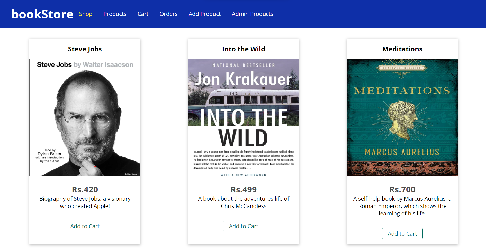

# bookStore-Project

About -> 
An online bookstore, which provides you with the features of a complete e-commerce platform.

Many features of the e-commerce platform are added like,
  1. Admin Side -> Adding, Editing, and Deleting products as needed.
  2. Customer Side -> Browsing through all the available books, adding them to the cart, and checkingout.

Upcoming Features -> 
  1. User Authentication
  2. Payment Options

Tech Stacks Used -> 
  1. Front-end: HTML, CSS, JavaScript
  2. Templating Engine: EJS (Tried PUG and Handlebars also, liked EJS better)
  3. Back-end: Node.js with Express.js
  4. DBMS: MySQL (Will try to implement NoSQL(MongoDB with Mongoose) in the next phase of project.)
  5. Design pattern: MVC Architecture

All the files are available.
Code is the cleanest code you will ever see.

Find the index page below:

